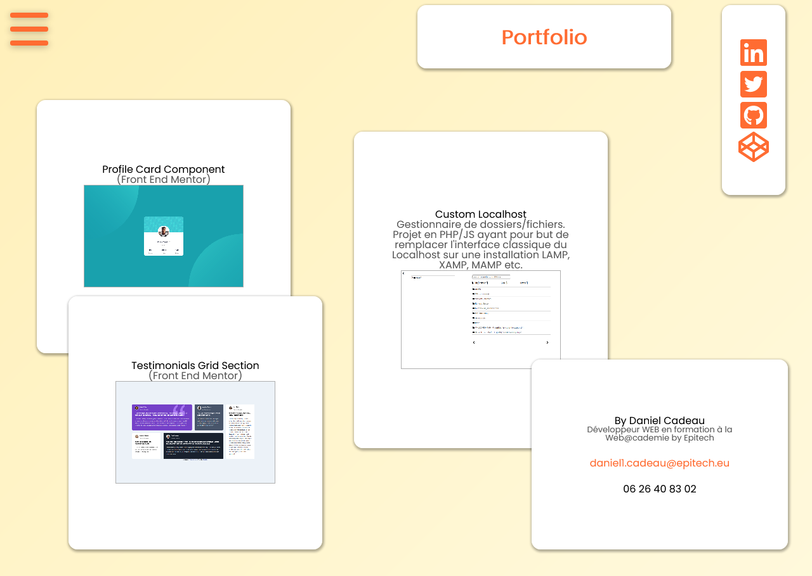

# MrDanielCadeau.github.io | OLD PORTFOLIO (V1)

ongoing development / développement en cours / проект в развитие

Welcome to this project. This GITHUB repository is my online portfolio. All my work on that project is provided on my free time. That's a simple interface, no DB, no BACK-END part, but there is lists of all my project and of course there is a lot of back oriented projects.

I hope you'll enjoy to navigate on this portfolio. Have a nice day !

//

Bienvenue sur ce projet, ce repository GITHUB est dédié à mon portfolio sur lequel je travaille en dehors de ma formation. Il est ici question d'un site très simple, sans BDD, framework etc, qui me permet justement de référencer des projets plus riches avec des liens renvoyant vers ceux-ci. Au cours de la formation nous aurons à développer un site e-commerce qui sera ainsi répertorier dans mon portfolio par exemple.

Je vous laisse découvrir tout ça et vous souhaite une agréable navigation !

//

Рад, что Вы заинтересовались моим портфолио. Вся работа проделаная для его создания - моё свободное время, которого мне сильно не хватает. Здесь всё максимально просто. Никакого бэк-энда, никаких фрэмворков, у этого портфолио одно признание: быть написаным максимально простым кодом, но при этом не жадничая элементами анимации, оригинальным интерфейсом в использовании и тд. Однако здесь собраны ссылки ко множеству моих линых и учебных проектов, так что и бэк-энд и фул-стак направленных проектов хватает.

Надеюсь Вам понравится навигация на этом сайте. Всего наилучшего!
